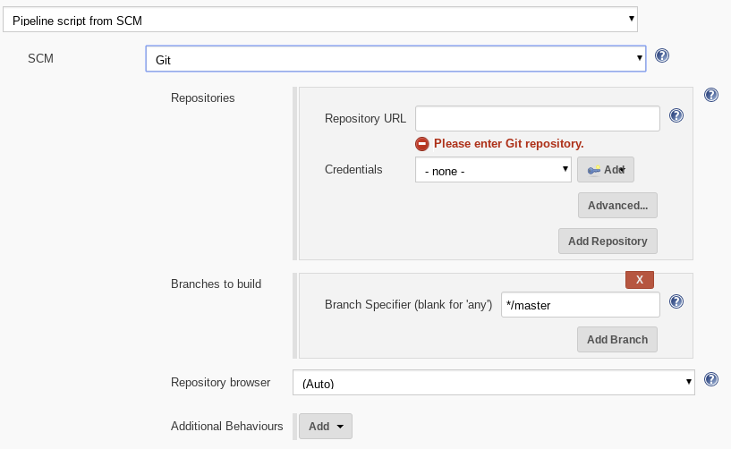

# Automated Image Builder with Jenkins, Packer, and Kubernetes
In this tutorial you will deploy a fully-functional implementation of the automated image building pipeline described in the [Automated Image Builds with Jenkins, Packer, and Kubernetes solution paper](https://cloud.google.com/solutions/automated-build-images-with-jenkins-kubernetes).

You will use [Google Kubernetes Engine](https://cloud.google.com/kubernetes-engine/) and [Kubernetes](http://kubernetes.io) to deploy the environment.

<a name="very-important-things"></a>
## Very Important Things
If you follow these instructions exactly, you will deploy (2) g1-small GCE instances and a network load balancer, all resources that are billed for. It is very important that you follow the instructions to turn down the cluster if you do not want to continue to be billed for these resources. [This calculator quote](https://cloud.google.com/products/calculator/#id=4539f510-f60f-4479-a686-5a4a37896368) provides an estimate of the monthly cost of the resources provisioned in this example.

Be sure to create a brand new project for this tutorial (instructions are in the deploy sections below). Also be sure to complete the [Delete the Deployment](#delete-the-deployment) section when you're done. It's super quick and will tear down everything you created.

## Conventions
The instructions in this tutorial assume you have access to a terminal on a Linux or OS X host. For Windows hosts, [Cygwin](http://cygwin.com/) should work.

You will need to enter commands in your terminal. Those commands are indicated in the following format, where `$` indicates a prompt (do not paste the $ into your terminal, just everything that follows it):

```shell
$ echo "This is a sample command"
```
## Deploy
### Deployment Requirements
Before you deploy the sample you'll need to make sure a few things are in order:

1. Create a new project in the [Google Developer Console](https://console.developers.google.com/project) and note the new project's ID.

1. In the [APIs & Auth section of the Google Developers Console](https://console.developers.google.com/project/_/apiui/api) of your new project, enable the following APIs:

    * Google Compute Engine
    * Google Kubernetes Engine API
    * Cloud Build API

1. Install the Cloud SDK verssion `0.9.68` or greater using [these instructions](https://cloud.google.com/sdk/).

1. Authenticate to gcloud:

    ```shell
    $ gcloud auth login
    ```

1. Set your project:

    ```shell
    $ gcloud config set project YOUR_PROJECT_ID
    ```

1. Enable `kubernetes` features:

    ```shell
    $ gcloud components update kubectl
    ```

1. If you are using Windows to complete the tutorial, install [Cygwin](http://cygwin.com/) and execute the steps in a terminal.

<a name="quick-deploy"></a>
### Quick Deploy
These quick deploy instructions are easiest way to get started. The work to create a Google Kubernetes Engine cluster and launch the necessary Kubernetes resources is captured in the `cluster_up.sh` script.

To quick deploy the image builder application:

1. Clone this repository (`$ git clone https://github.com/GoogleCloudPlatform/kube-jenkins-imager.git`) or download and unzip a [copy from releases](https://github.com/GoogleCloudPlatform/kube-jenkins-imager/releases).

1. Navigate to the directory:

    ```shell
    $ cd kube-jenkins-imager
    ```

1. From a terminal in the directory you cloned or unzipped, run:

    ```shell
    $ ./cluster_up.sh
    ```

     The script will take several minutes to complete. The abbreviated output should look similar to:

      ```shell
      Creating cluster imager...done.
      ...
      ...
      <TRUNCATED>
      ...
      ...
      All resources deployed.
      ```
1. Continue to the [Access Jenkins](#access-jenkins) section (skip the Stepwise Deploy section)

<a name="stepwise-deploy"></a>
### Stepwise Deploy
You can find open the `cluster_up.sh` script and execute the commands from each line for a closer look at everything that's taking place.

<a name="access-jenkins"></a>
## Access Jenkins
1. Access the URL output when you created your deployment. Click the login button and use the username and password
   that was output by the `cluster_up.sh` script:

1. After a successful login you should see the Jenkins admin landing page:

    

## Configure Jenkins
In the following sections you will create a credential, define and run an image build job, and backup the Jenkins configuration.

### Create Credentials
1. **Optional:** Configure a Jenkins login (in addition to the basic access authentication at the reverse proxy) by navigating to **Manage Jenkins >> Configure Global Security** and configuring authentication and authorization settings to your requirements

1. Create a credential by clicking on the **Credentials** link in the left nav, then clicking the **Global credentials** link:

    

1. Click **Add Credentials** in the left nav, choose `Google Service Account from metadata` in the **Kind** dropdown, and click **OK**. The Project Name will be auto-populated:

    

### Create and Run a Build Job
In the following sections you will clone an existing repo (from the previous [Scalable and Resilient Web Applications](https://github.com/GoogleCloudPlatform/scalable-resilient-web-app) tutorial that includes a working build configuration. You will then push that repo to your project's Cloud Repository, create a Jenkins job to build it, and run the job.

#### Replicate a GitHub Repo
1. Clone the existing sample repository to your workstation (you must have `git` installed) and go into the new directory:

    ```shell
    $ git clone https://github.com/GoogleCloudPlatform/scalable-resilient-web-app.git
    $ cd scalable-resilient-web-app
    ```

1. Create a Cloud Source Repository and push your code to it:

    ```shell
    $ gcloud source repos create scalable-resilient-web-app
    $ git config --global credential.https://source.developers.google.com.helper gcloud.sh
    $ export PROJECT=$(gcloud config get-value project)
    $ git remote add google https://source.developers.google.com/p/${PROJECT}/r/scalable-resilient-web-app
    $ git push --all google
    ```

1. After you've pushed your files to the Cloud Source Repository, find and copy its Fetch URL for use in the next section:

    ```shell
    $ git remote -v show -n google | grep Fetch
      Fetch URL: https://source.developers.google.com/p/your-new-project/
    ```

    **Note:** The URL should be your project ID appended to the string `https://source.developers.google.com/p/`


#### Create Jenkins Job
1. Access Jenkins in your browser. If you don't remember the URL, you can run the following command in the terminal where you created the deployment to find it:

    ```shell
    $ echo http://$(kubectl get service cd-jenkins -o "jsonpath={.status.loadBalancer.ingress[0].ip}")
    ```

1. From the Jenkins main page, choose **New Item*, name the item `redmine-immutable-image`, choose **Pipeline**, then click **OK**. It is important the name does not include spaces.

    

1. Under **Build Triggers**, choose Poll SCM and enter a value for Schedule. In this example, `H/5 * * * *` will poll the repository every 5 minutes. Choose a value that you consider appropriate:

    

1. Under **Pipeline**, in the **Definition** dropdown choose **Pipeline script from SCM**.

1. Paste your Cloud Repository URL (`https://source.developers.google.com/p/your-project-id`) from the previous section, and choose the credential you created earlier from the dropdown:

    

1. Click Save to save your job.

#### Run the Build
1. After saving the project, choose the **Build Now** menu item, then click the job number when it appears:

    

1. Choose the **Console Output** menu item and observe the job's progress:

    

  Jenkins parallelizes the GCE and Docker builds. You can expect the build to take about 20 minutes; the sample build is updating the OS, building and installing Ruby, and installing the Redmine project management application and all of its gem dependencies.

1. The build is done when you see a `Finished: SUCCESS` line in the output. A few lines before that you should see the outputs (GCE and Docker iamges) of the build:

    ```shell
    ==> Builds finished. The artifacts of successful builds are:
    --> googlecompute: A disk image was created: redmine-1431028076-master-c84d21f
    --> docker: Imported Docker image: 0717053a7fce3c637a5bfd887954f41b4327e80493eb6492277e2dbb132c2bf4
    --> docker: Imported Docker image: gcr.io/your-new-project/redmine:master-c84d21f
    ...
    ...
    Finished: SUCCESS
    ```

1. In the [Google Developers Console](https://console.developers.google.com) navigate to **Compute > Images** and confirm that your GCE image for Redmine is there:

    

<a name="delete-the-deployment"></a>
## Delete the Deployment
It is very important (as mentioned in the [Very Important Things](#very-important-things) section of this document) that you delete your deployment when you are done. You will be charged for any running resources.

Whether you followed the [Quick Deploy](#quick-deploy) or [Stepwise Deploy](#stepwise-deploy) instructions, deleting resources is very easy. Simply delete the project you created at the beginning of this tutorial:

1. Navigate to the [Projects page of the Google Developer Console](https://console.developers.google.com/project), find your project, click the trash can icon to delete, then type the project ID and click Delete Project.
